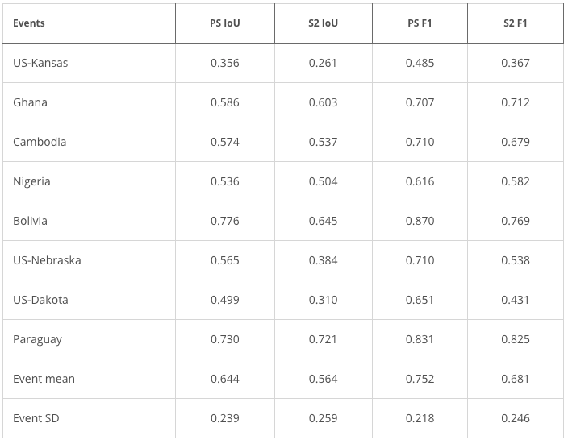

# FloodPlanet Segmentation
This repository demonstrates water body pixel segmentation on the [FloodPlanet](https://zenodo.org/records/15238572) dataset, a hand-labeled high resolution multi-sensor dataset that includes 19 flood events that occurred between 2017 and 2020. The main focus is segmentation on the Sentinel-2 subset of FloodPlanet, although segmentation on other subsets can also be performed.

## Data Loading
All the data code can be found in the `data_code` folder. Creating the dataset is done by filtering out Sentinel-2 channels that aren't needed and then adding in the relevant Land Cover Classification (LCC) and Digital Elevation Model (DEM) data that overlaps with the existing Sentinel-2 training data.

To get started, download the [FloodPlanet](https://zenodo.org/records/15238572) data. Then, in `dataloader.py`, uncomment the code below (line 166):
```python
dataset = Sentinel2DatasetDownload("FloodPlanet/FloodPlanet")
```
Then, running `dataloader.py` will download all the needed LCC and DEM files that will be stored in a cache, along with the 7 band TIFs actually used during training in the `tif_model_training` folder. The first 5 bands are R, G, B, NIR, and SWIR from Sentinel-2, and the next 2 bands are the LCC and DEM channels. All the functions to extract the LCC and DEM files can be found in `data_loading_utils.py`, and the mean and std used during normalization can be calculated by running `dem_mean_std.py`. If you would like, run `data_extraction_demo.py` to see a visualization of the Sentinel-2, LCC, and DEM channels with dummy data. The dataloader used during training is `Sentinel2Dataset`, and instead of downloading caches, it reads TIFs directly from the `tif_model_training` folder for efficiency.

## Training
All the training code is in the `train` folder. The main model used here is a UNet with a Resnet34 encoder. You can also use the DeepLabV3 segmentation model with a Resnet101 encoder by changing the `model` parameter in the config in `train.py` to "deeplabv3". Loading the dataset normally takes a few minutes since it must read around 300 TIF files. By default, the model trains for 100 epochs with a learning rate of 0.001, using cosine annealing with 
T_max = 100. All of these hyperparameters can be changed in the config in `train.py`.

## Results
The Sentinel-2 subset of the FloodPlanet dataset is decently difficult, making it very difficult for even SOTA pixel segmentation models to achieve great results. Sample predictions can be found in `results/sample_val_preds.png`, and the train test curve is in `results/train_test_curve.png`. However, the UNet significantly outperforms the results from the original [paper](https://spj.science.org/doi/10.34133/remotesensing.0575). 

These are the original paper results, achieving an average IoU on the Sentinel-2 (S2) subset of 0.624 and an average F1 score of 0.736. On the other hand, the UNet model is able to achieve an IoU of 0.71 and a F1 score of 0.82, clearly outperforming the original paper.